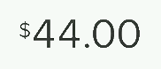

# react-odometer-animation

A React component that coordinates, calculates, and animates the transition between two numbers like the odometer in a car, like so:

* **Efficient:** Intelligently reduces the number of re-renders by React (and therefore, recalculations of reel dimensions) and uses a "film reel" method to create a component that can repeat many times on the same page without stressing the browser too much during animation
* **Flexible:** Component does not create an image, but rather a text-based element that can be configured in font size, family, and position via the parent application's CSS. Accommodates whole numbers and decimals (does not support negative numbers yet!)

## Installation

UNDER CONSTRUCTION: For now refer to the source script and styles in ~/src/Odometer/ and decide how to copy paste it into your project.

## Features / Props

* **Current Position:** Dictate which number is currently visible by binding the value of props.currentPosition (0 for "fromValue" or 1 for "toValue")
* **Flow Direction:** By defining prop.flowReverse as true or false, decide if the greater number is on the top or bottom of the "reel"
* **Faded Borders:** By defining prop.fadedBorder as true or false, and prop.fadeColor as a CSS-valid color value, allow the odometer animation to fit into any solid color background and create a smoother "fade" for the transition of the numbers